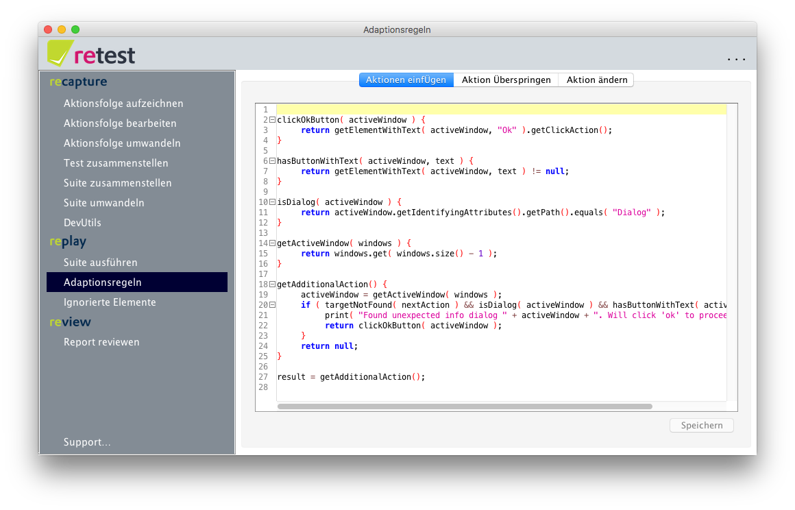




Adaptions Regeln
================

Hier können Sie Regeln bearbeiten, um Tests während der Wiedergabe zu ändern. Wir nennen das "passives Update".
Dies bietet eine viel größere Flexibilität, um eine große Menge aufgezeichneter oder generierter Tests anzupassen, bei gleichzeitig viel weniger erforderlichem Aufwand.
Es ermöglicht auch, Tests viel flexibler und anpassungsfähiger zu gestalten, und z.B. das Erscheinen oder Verschwinden von Popups zu erlauben dies entsprechend zu behandeln.

Die Sprache, um diese Regeln zu definieren, ist [BeanShell](https://github.com/beanshell/beanshell/wiki/Introduction).
Eine kurze Einführung in die grundlegende Syntax finden Sie [hier](https://github.com/beanshell/beanshell/wiki/Basic-syntax).
Im wesentlichen handelt es sich um vereinfachtes Java.
Beim Speichern wird Ihr Skript kurz auf syntaktische Korrektheit geprüft.

Die Reihenfolge, in der die Skripts während der Wiedergabe ausgeführt werden, ist wie folgt:

1. Zuerst werden zusätzliche Aktionen in den Test eingefügt und direkt ausgeführt, solange Aktionen vom Skript "Aktionen einfügen" zurückgegeben werden.
   Wenn mehr als die konfigurierte Eigenschaft `de.retest.maxInsertedActions` Aktionen eingefügt werden, wird ein Fehler ausgelöst, um Endlosschleifen zu vermeiden.
2. Dann wird die `nextAction` übersprungen, wenn das Skript "Aktion überspringen" `true` zurückgibt.
3. Wenn die Aktion nicht übersprungen wird, wird sie gemäß dem Skript "Aktion ändern" geändert und dann ausgeführt.

Berücksichtigen Sie diese Reihenfolge beim Verweisen auf vordefinierte Variablen im Skript.

Vordefinierte Variablen sind:

- `windows` referenziert eine Liste der aktuellen Fenster.
- `previousAction` referenziert die zuvor ausgeführte Aktion. Dies ist die zuletzt eingefügte Aktion, sofern eine eingefügt wurde.
- `nextAction` referenziert die als nächstes auszuführende Aktion.

Sie können auch auf "frühere" Informationen aus dem Test (bspw. mit welchem Benutzer wurde eingelogt etc.) zugreifen. 
Die Ausführungsumgebung bleibt erhalten. 
Alle Variablen, die sie in einer Ausführung des Skriptes setzen, sind bei der nächsten Ausführung noch gesetzt.
Sie können also einfach eine Funktion erstellen, die sich beim Anmelden den angemeldeten Benutzer "merkt", indem eine entsprechende Variable gesetzt wird.
Diese Variable können Sie dann bei späteren Ausführungen einfach abfragen.

Wenn Sie der Meinung sind, dass die Informationen, die an die Skripte weitergegeben werden, für Ihre Zwecke nicht ausreichend sind, wenden Sie sich bitte an den Support.

Für einige einfache Beispiele von BeanShell, werfen Sie bitte einen Blick auf unsere Demo.

